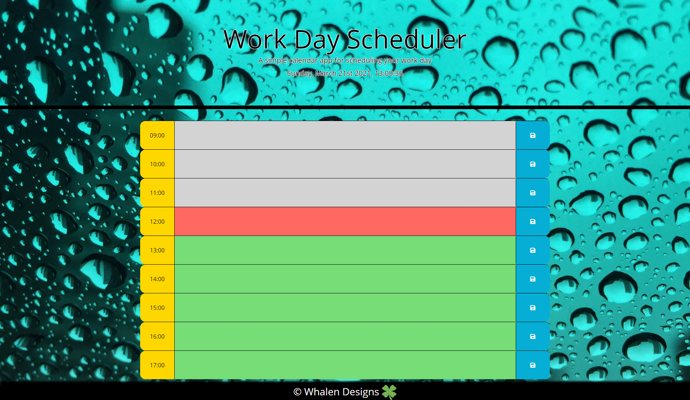

# 05 Server API's Day Planner

## Contributers
* Chris Whalen, Github: **[CobaltFrostfish](https://github.com/CobaltFrostfish)**

## Links
* **[Repository](https://github.com/CobaltFrostfish/fancy-day-planner)**
* **[Live site](https://cobaltfrostfish.github.io/fancy-day-planner/)**

## The project
This project contains a planner to help you schedule your day through the hectic world of coding. If you're using some form of day planner such as this then you're probably making an attempt to keep calm and control the chaos in your life, hence why I made my day planner with some subtle relaxing elements. In my day planner your first met with a nice rain droplet back drop and a relaxing color scheme to help keep that chill you're working so hard to maintain. I live my life off of 24 hour time and with most people designing their planners based on 12 hour time I decided to make mine accessible to the 24 hour nerds such as myself! So fill out the planner, return to zen, and keep coding on! It's fancy huh?

## Technologies applied
* HTML
* CSS
* JavaScript
* Bootstrap
* MomentJS
* Jquery

## The final production:
